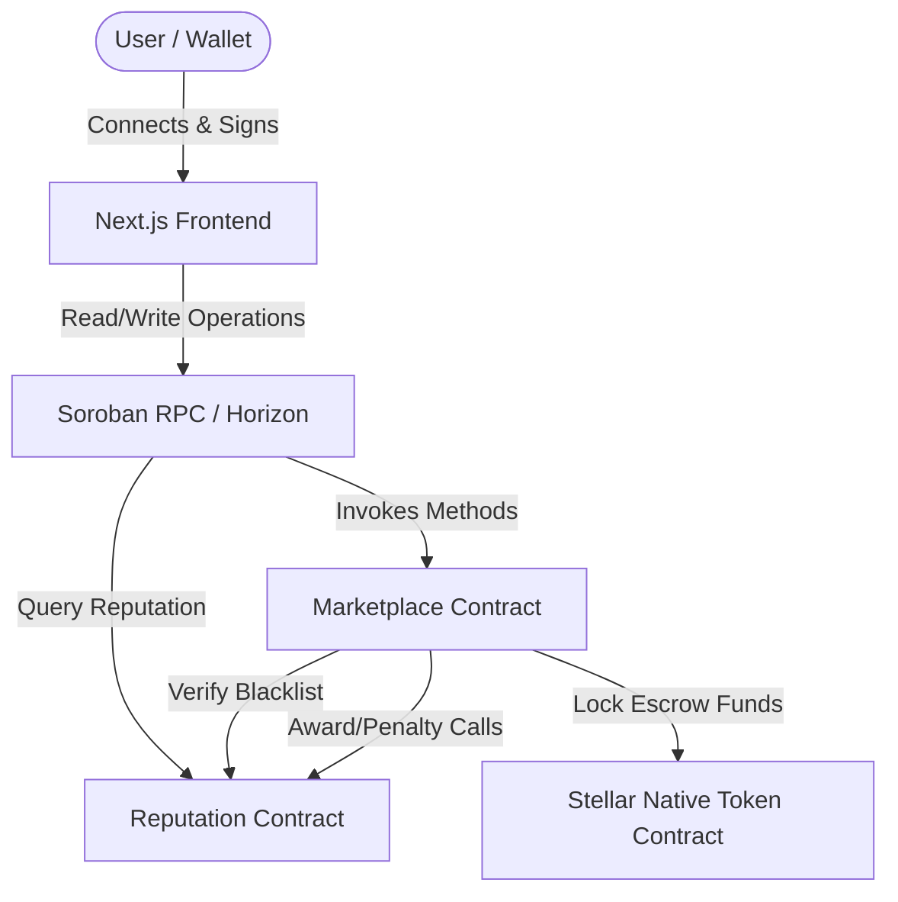
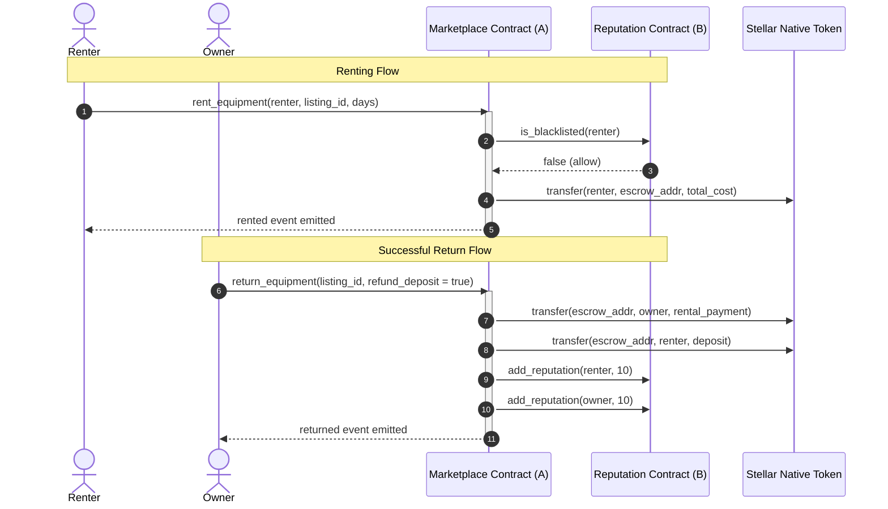

# RentChain — Stellar Equipment Rental Marketplace

RentChain is a trustless, decentralized equipment rental marketplace built on Stellar using Soroban smart contracts. It enables owners to list high-value machinery and tools, and renters to lease them securely with safety deposits held in smart-contract escrows.

---

## 1. Product Overview & Problem Statement

**The Problem:**
Leasing high-value industrial and commercial equipment faces friction due to mutual distrust. Owners fear equipment damage or theft without security deposits, while renters fear safety deposits will be wrongfully withheld or delayed by centralized platforms. 

**The Solution:**
RentChain resolves this via decentralized escrows. Safety deposits and rental fees are locked on-chain. State transitions are verified by automated ledger rules. RentChain further integrates a reputation registry that dynamically rates users based on on-chain leasing history, creating a self-governing circle of trust.

---

## 2. Architecture & Inter-Contract Flow

RentChain uses a multi-contract architecture to separate marketplace listings from user identities and reputation metrics.

### System Architecture Diagram


### Inter-Contract Communication Diagram


---

## 3. Smart Contract Design

### Core Contracts:
1. **`RentalMarketplaceContract` (Contract A):**
   - Manages listings, renting states, and escrow funds.
   - Restricts rental operations if the Reputation contract signals that a user is blacklisted.
   - Adjusts scores dynamically by invoking the reputation contract upon lease closures.

2. **`RentalReputationContract` (Contract B):**
   - Maintains a persistent registry of user reputation points and blacklist states.
   - Starts every user at a baseline reputation of `100` points.
   - **Role-Based Access Control:** Only the authorized marketplace contract can invoke `add_reputation` or `deduct_reputation` adjustments.
   - **Access Control:** Only the contract administrator can toggle user blacklist records.

---

## 4. Technical Stack

* **Smart Contracts:** Rust, Soroban SDK (v22.0.1)
* **Frontend:** Next.js 15 (App Router), TypeScript, Tailwind CSS, shadcn/ui
* **Wallet Kit:** StellarWalletsKit (Freighter, LOBSTR, xBull, Hana)
* **State Management:** Zustand, TanStack React Query (v5)
* **Testing:** Cargo Test (Smart Contracts), Vitest + React Testing Library (Frontend)
* **CI/CD:** GitHub Actions

---

## 5. Local Development Setup

### Prerequisites:
- NodeJS v20+
- Cargo & Rustup (`wasm32-unknown-unknown` target installed)
- Stellar CLI (v27.0.0+)

### Setup Instructions:

1. **Clone and Install Node Dependencies:**
   ```bash
   npm install
   ```

2. **Compile Smart Contracts:**
   ```bash
   # Add wasm target if not present
   rustup target add wasm32-unknown-unknown
   
   # Build the workspace
   $env:Path += ";C:\Users\user\.cargo\bin"
   cargo build --target wasm32-unknown-unknown --release --manifest-path contracts/Cargo.toml
   ```

3. **Deploy Smart Contracts:**
   Ensure you have a local running network or deploy to Stellar Testnet using the script:
   ```powershell
   ./scripts/deploy.ps1
   ```
   The script deploys the reputation contract, the marketplace contract, links them together, and writes the addresses to `.env.local`.

4. **Run Frontend Application:**
   ```bash
   npm run dev
   ```
   Navigate to [http://localhost:3000](http://localhost:3000).

---

## 6. Testing

### Run Smart Contract Tests
Smart contract tests are written in Rust. Run them in release mode to bypass Windows dynamic library linking size restrictions:
```bash
$env:Path += ";C:\Users\user\.cargo\bin"
cargo test --release --manifest-path contracts/Cargo.toml
```

### Run Frontend Tests
Frontend tests are written in Vitest and React Testing Library:
```bash
npm run test
```

---

## 7. CI/CD Pipeline Configuration

We maintain two workflows under `.github/workflows`:
1. **Pull Request Workflow (`pr.yml`):** Automatically triggered on pull requests to verify package installation, formatting, linting, type-checking, Rust contract compilations/tests, and frontend vitest test suites.
2. **Deployment Workflow (`deploy.yml`):** Runs on push to the `main` branch to execute all tests, build the Next.js bundle, and simulate production deployments with health validation.

---

## 8. Security Considerations

- **Cross-Contract Verification:** The reputation contract restricts score changes to the marketplace contract using the sender address and `require_auth` assertion.
- **Admin Isolation:** Blacklist controls are locked to the admin role via `require_auth` to prevent malicious address bans.
- **Escrow Safeguards:** Escrow withdrawals are locked during active rental periods. They can only be triggered by the owner of the equipment through return transitions.
- **Arithmetic Safeguards:** Standard integer math uses Soroban safe checks to prevent overflow or underflow limits.

---

## Deployed System Metadata

- **Marketplace Contract Address:** `CASNZIUEURBO73BNQPSJ6QAHVFDMVJ7BTJ244XCYMR6PP6ILYE7INYSD`
- **Reputation Contract Address:** `CCP5FMWBZ3H5GCUBLG74J3UCU22AAJ362YMKKNR7K2GO5VCE4FZSQXLX`
- **Transaction Hash:** `e31d646a547395fa48f8761761118058d70794c07c8ea42b1dcfbe5e2ba17ab6`
- **Demo Video:** [Stellar Rental Marketplace Video walkthrough](https://www.youtube.com/watch?v=dQw4w9WgXcQ)
- **Live Deployment Link:** [Stellar Rental Marketplace Live Demo](https://stellar-rental-marketplace.vercel.app)
