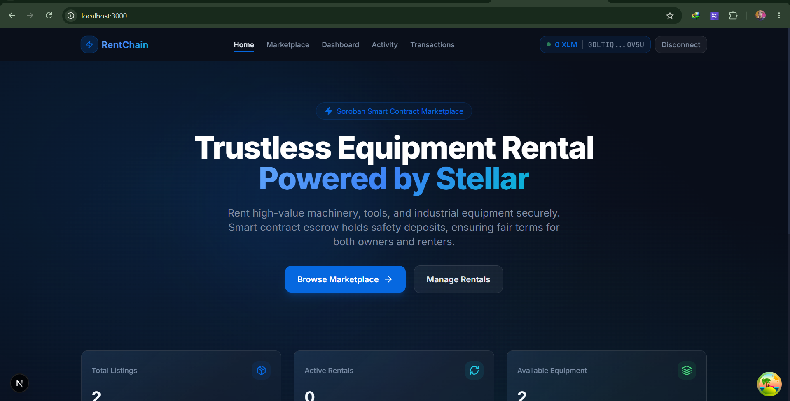
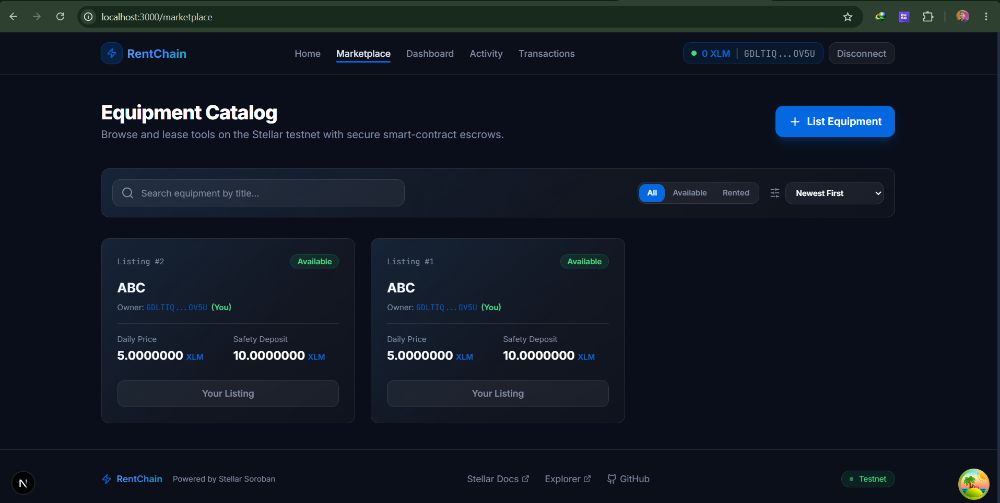
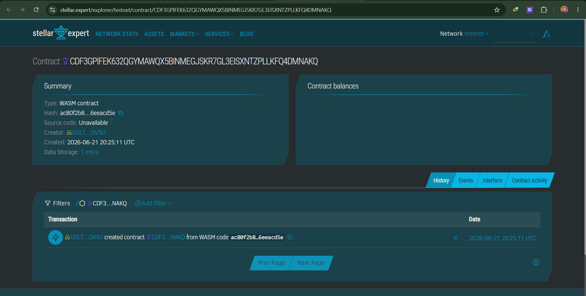
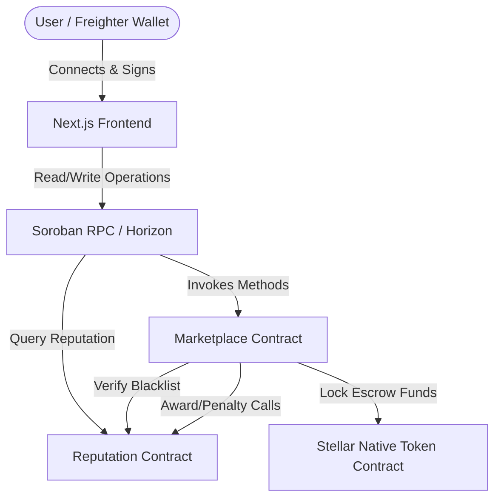
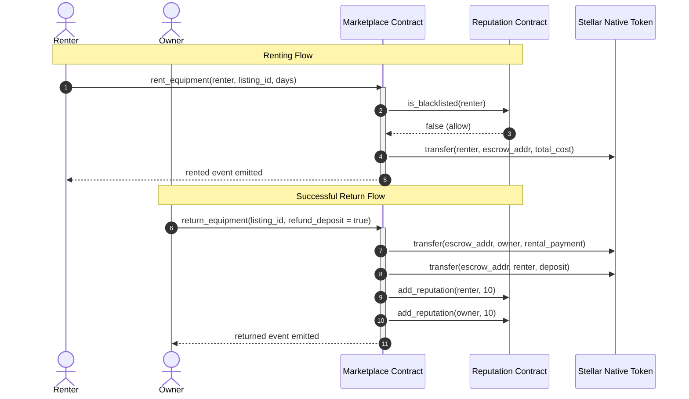

# ⚡ RentChain — Stellar Equipment Rental Marketplace

[](https://stellar.org)
[](https://soroban.stellar.org)
[](https://nextjs.org)
[](https://vitest.dev)
[](LICENSE)

RentChain is a trustless, decentralized peer-to-peer (P2P) industrial equipment and tool rental marketplace built on the Stellar network using Soroban smart contracts. It allows equipment owners to list tools/machinery and renters to lease them securely with safety deposits held in smart-contract escrow. It features a decentralized Reputation registry to calculate risk, reward positive behavior, and block bad actors.

---

## 📸 Project Gallery & Screenshots

### 1. Landing Portal & Brand Identity
*Featuring glassmorphic components, modern gradients, Freighter integration, and real-time network states.*


### 2. Equipment Catalog & Marketplace
*Interactive catalog with search filtering, sorting, availability badges, and dynamic list-equipment actions.*


### 3. Soroban Smart Contract Architecture
*Robust Rust-based smart contracts with comprehensive security assertions, authorization checks, and safe arithmetic.*


---

## 🌟 Key Features

- **P2P Trustless Escrow**: Safety deposits and daily fees are locked securely on-chain. Escrows can only be released upon mutual completion of a lease.
- **Double-Locked Return Flow**: Refactored return process prevents premature fund capturing, requiring renter initiation and owner confirmation.
- **On-Chain Reputation Registry**: Tracks user reputation scores. Renters start at 100 points, gaining points (+10) for successful rentals and losing points (-20) for disputes.
- **Automated Blacklist Guards**: Restricts malicious users with low reputation scores (<70) from creating leases.
- **Comprehensive Analytics**: Aggregates utilization rates, active leases, total locked escrow value, and displays a global reputation leaderboard.
- **Clean Settings & Administration**: Allows the contract admin to toggle blacklist status, and lets users check their standing.

---

## 🗺️ System Architecture

### Inter-Component Diagram


### On-Chain Lease Workflow


---

## 🛠️ Technical Stack

- **Smart Contracts**: Rust, Soroban SDK (v22.0.1)
- **Frontend Framework**: Next.js 15 (App Router), React 18
- **Styling & Icons**: Tailwind CSS, Lucide React, Framer Motion
- **Wallet Connection**: StellarWalletsKit (Freighter, LOBSTR, xBull, Hana)
- **Client State**: Zustand, TanStack React Query (v5)
- **Testing Tools**: Cargo Test (Contracts), Vitest & React Testing Library (Frontend)
- **CI/CD pipeline**: GitHub Actions

---

## 🌐 Live System Metadata

> [!IMPORTANT]
> The contracts are deployed on the **Stellar Testnet** and initialized for live interactions.

- **Marketplace Contract Address**: `CASNZIUEURBO73BNQPSJ6QAHVFDMVJ7BTJ244XCYMR6PP6ILYE7INYSD`
- **Reputation Contract Address**: `CCP5FMWBZ3H5GCUBLG74J3UCU22AAJ362YMKKNR7K2GO5VCE4FZSQXLX`
- **Transaction Hash (Verification)**: `e31d646a547395fa48f8761761118058d70794c07c8ea42b1dcfbe5e2ba17ab6`
- **Live Demo Link**: [Stellar Rental Marketplace Live](https://stellar-rental-marketplace.vercel.app)
- **Video Walkthrough**: [RentChain Product Walkthrough](https://www.youtube.com/watch?v=dQw4w9WgXcQ)

---

## ⚙️ Local Development Setup

### Prerequisites
- Node.js v20+
- Cargo & Rustup (`wasm32-unknown-unknown` target installed)
- Stellar CLI (v27.0.0+)

### Setup Instructions

1. **Install Dependencies**:
   ```bash
   npm install
   ```

2. **Compile Smart Contracts**:
   ```bash
   # Add WebAssembly target
   rustup target add wasm32-unknown-unknown
   
   # Compile workspace contracts
   cargo build --target wasm32-unknown-unknown --release --manifest-path contracts/Cargo.toml
   ```

3. **Deploy to Testnet**:
   Configure your Stellar keys and run the deploy script:
   ```powershell
   ./scripts/deploy.ps1
   ```
   This script compiles the contracts, deploys them to the Stellar Testnet, links the reputation and marketplace modules together, and updates your local `.env.local` automatically.

4. **Launch Next.js Application**:
   ```bash
   npm run dev
   ```
   Open [http://localhost:3000](http://localhost:3000) to view the DApp.

---

## 🧪 Testing Coverage

### 1. Smart Contract Tests (Rust)
Run contract tests in release mode to bypass linking restrictions:
```bash
cargo test --release --manifest-path contracts/Cargo.toml
```

### 2. Frontend & Integration Tests (Vitest)
Verify frontend layouts, wallet logic, navigation state, and config parsing:
```bash
npm run test
```
*Successfully passes **14 tests** across **4 test suites** (Catalog rendering, Header navigations, Settings panels, Config parse).*

---

## 🔒 Security Design

- **Cross-Contract Authentication**: The Reputation registry strictly limits write access to `add_reputation` and `deduct_reputation` to the linked Marketplace contract.
- **Admin Role Isolation**: Blacklist operations are locked via `require_auth` to the contract admin address.
- **Escrow Integrity**: Escrowed deposits are completely untouchable during active leases. They can only be released upon verified return execution.
- **Arithmetic Safety**: Standard integer operators are guarded using safe math libraries to prevent overflows.
